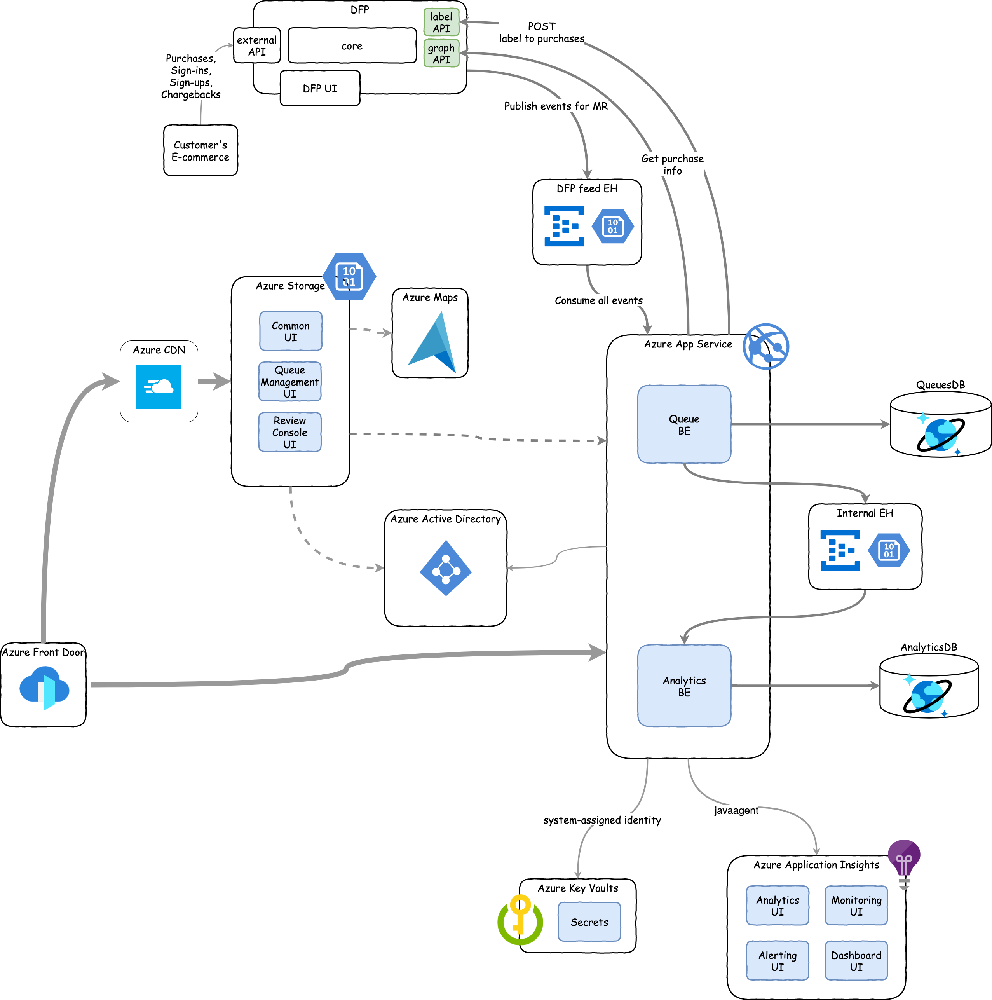

# Microsoft Dynamics 365 Fraud Protection - Manual review

## Main documents
* [FE README](./frontend/README.md)
* [BE README](./backend/README.md)
* [Deployment README](./arm/README.md)

## Solution structure
  

## Microsoft Open Source code of conduct

For additional information, see the [Microsoft Open Source Code of Conduct](https://opensource.microsoft.com/codeofconduct).