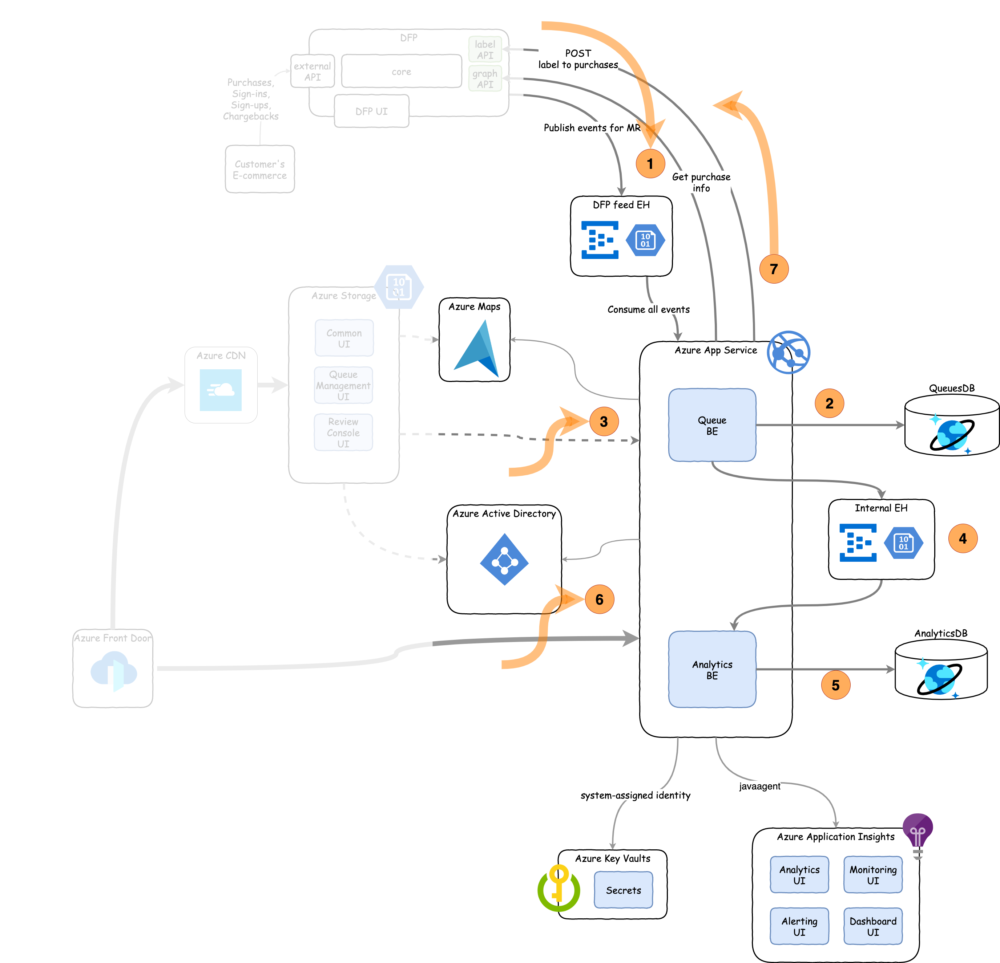
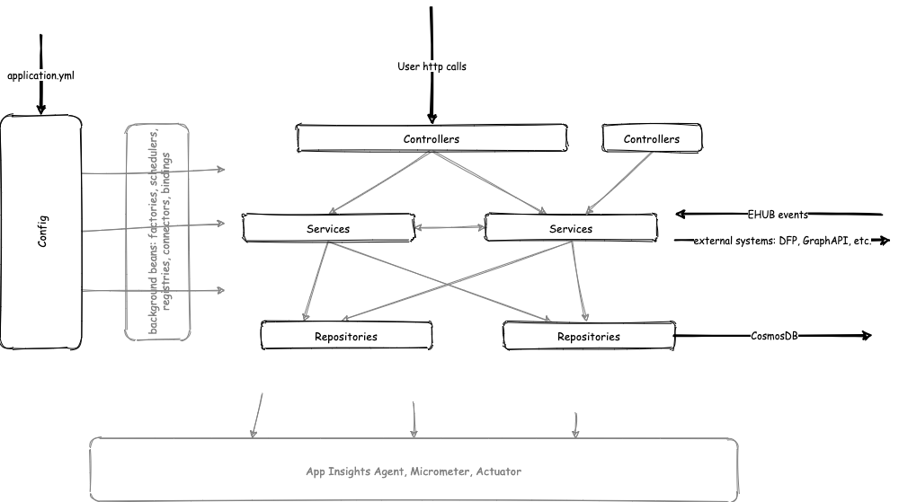
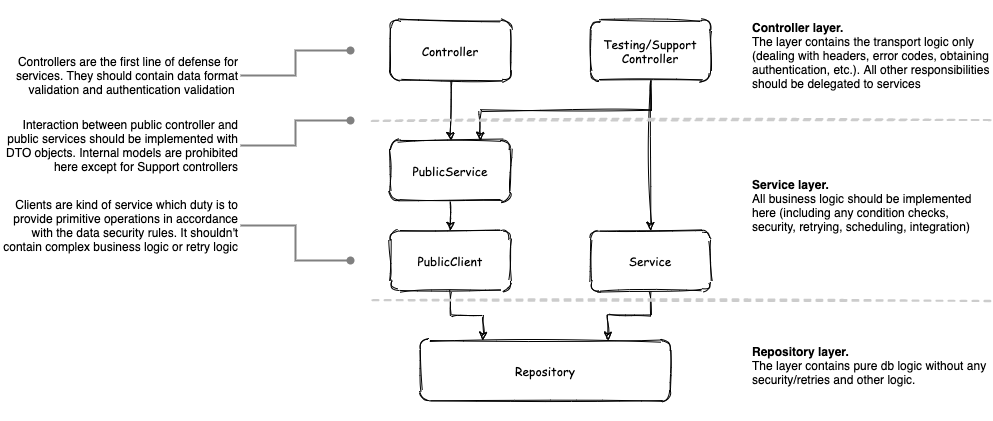

# Manual Review Contribution guide (backend)
This document: 
* contains low-level solution details
* is used as an onboarding guide for newcomers
* should be considered by contributors to pass PR (pull request) procedure 

> The project is alive and rapidly extended so if you see any inaccuracies, please, 
notify maintainers of the solution. We appreciate any feedback.

Summary:
* [Architecture description](#architecture-description)
    * [Applications](#applications)
    * [Storage](#storage)
    * [External services](#external-services)
    * [Internal layers](#internal-layers)
    * [Security](#security)
    * [Logging](#logging)
    * [Data loss protection](#data-loss-protection)
* [Contribution rules](#contribution-rules)
    * [Versioning](#versioning)
    * [Non-functional requirements](#non-functional-requirements)
    * [Style guide](#style-guide)
    * [Logging requirements](#logging-requirements)
* [In-place solution list](#in-place-solution-list)

The [Architecture description](#architecture-description) is the section which is intended for anyone who is
going to read source code. There you can find most important high-level description of the solution backend part.

Once you need to change something inside the code, it's crucial to get aware of [Contribution rules](#contribution-rules).

On case if you implement some new feature or met some unclear construction in code, you could find the explanation 
in [In-place solution list](#in-place-solution-list). Also, take into account that any PR must be checked against each 
principle described there. 


## Architecture description
The Manual Review backend is a Web API that uses microservices architecture so each service can function apart from the others.
Also, it tightly relies on Azure services in part of security, logging, data storing and exchanging.
The main high-level flow is:
1. Receive data about purchases from DFP.
2. Store data as items in MR Storage. Then enrich it and place among queues.
3. Users process items in queues.
4. Stream item processing events to analytics service.
5. Store event data in a way that suit analysis usage.
6. Users and 3rd-party applications observe analytical data.
7. Report processing results to DFP.



Different microservices connected to each other either by asynchronous persistent messaging systems or 
by synchronous protocols with mandatory repeating mechanism. Such structure is intended for a separate scaling
of the processing part and the analytical part. The asyncronous messaging should help to smooth load.


### Applications
Currently, there are two application in the backend part: 
* mr-queues
    > Queues is a main service of the project. It provides a REST API for managing of queues, and items inside those queues, and item-based dictionaries.
    For now, it also provides API for other real-time processing functions (users, tokens, app settings), but in the future it should be moved to a separate services.  
   
* mr-analytics
    >Analytics is a service for aggregating, computing and retrieving analytics data through a REST API. 
    It retrieves purchases that are being processed by fraud analysts, sends them to DFP and stores them into a database. 
    It also provides an API for generating dashboards based on collected analytics data.

Applications are compiled into executable jar-files intended to run in Azure App Service instances. 

Also, there are several libraries, that contains common solution logic:
* azure-graph-client
* cosmos-utilities
* dfp-auth-starter
* durable-ehub-starter
* model

The detail description could be found in `README.md` file of each library module.

All modules are Gradle projects and could be build, tested and launched by it. The source code 
structured in accordance with Java/Spring best practices and initially was created by 
[Spring Initializr](https://start.spring.io/). 

To get understanding about correct construction of backend components, please, review [In-place solution list](#in-place-solution-list).


### Storage
The main solution storage is an instance of Azure CosmosDB. We choose it because:
* It has distributed structure and elastic scalability.
* It could perform complex queries with filtering, aggregation and preprocessing (UDF).
* It supports geo-redundancy

As Cosmos DB is NoSQL DB, it requires careful respecting of locking and consistency principles. 

Please, refer [In-place solution list](#in-place-solution-list) to get more details about exact cases and approved patterns.


### External services
There are some services which are used by applications.

On initialization:
* Applications connect to Azure Key Vault to get the sensitive configuration. Please, refer [In-place solution list](#in-place-solution-list) 
    to find which and how information should be stored there.
* Properties are retrieved from property-files that placed along with executable jar-files, but some dynamic
    properties in property-files are refer to environment variables that should be correctly defined during 
    App Service deployment. Also property files are separated by profiles. Please, refer [In-place solution list](#in-place-solution-list) 
    to find more information.

At runtime:
* Applications are connecting to Azure Active Directory to get user information. Check [In-place solution list](#in-place-solution-list) 
    to find rules of Azure AD usage.
* All logging and monitoring information is sent to Azure Application Insights. Check [In-place solution list](#in-place-solution-list) 
    to find support requirements.
* Applications are actively exchanging data with DFP. Check [In-place solution list](#in-place-solution-list) 
    to find support requirements.
* For some special cases, applications could communicate with other external services, e.g. Map service, Email disposability service, etc. 
    Check [In-place solution list](#in-place-solution-list) to find support requirements.
    
    
### Internal layers
Applications follow Spring framework and all components inside are beans. It starts execution
by calling `SpringApplication.run()` and then rely on declarative bean configuration described 
by in-code annotations and property files. Needless to say that annotations hide under the hood
the drastically big amount of functionality, so the knowledge of following tool is mandatory:
* Lombok
* Resilience4j
* Spring Data
* Spring Web
* Spring Core (beans, services, configs, schedulers, caches)

There are no dynamically created beans but some of them contain their own lifecycle inside,
e.g. Sheduled tasks, daemon workers, etc. Before putting any code inside, please, review and
analyze main purpose of existing beans and only then decide where to place the code.

Main applications follow layered architecture. Each bean must fit only one layer but on 
each layer there could be several beans that works together to share responsibility:


Applications are configured on the startup by standard Spring mechanisms.

Controllers are responsible for incomming request/command flow. 
In some cases (Event Hub Processors) they could be implicit and should be managed only by the configuration.

The service layer is the richest and complex layer. All business logic should be placed here. 
Execution of services could be triggered in a different ways:
* by external call
* by incoming event
* by scheduled task

Repositories - are interfaces for outcoming request/command flow. In some cases Clients play a role of repositories.

During runtime execution information is continuously fed to monitoring systems. To interact with some of them there are
beans like `MeterRegistry`. Only logging is accessed through static methods. 

Also, there are `model`s which are not beans in general meaning. All models placed in a separate package and served 
for cross-bean communication. 


### Security
There are two layers of security for users:
* Endpoint level: whether user has the role which is allowed to call particular endpoints.
    This is a first-level defence barrier that insures a user can't permit inapropriate 
    *actions*. Checked on controller layer.
* Data level: whether user has access to read/create/update specific specifyc entity. 
    This is a second-level defence barrier that insures a user actions can't *impact 
    data* to which a user has restricted access in complex or implicit actions. Checked
    on public client layer.

Also, there are 2 ways to authenticate incoming requests:
1. by data inside the token (for external applications that connect to MR).
2. by DFP role which retrieved from Azure Graph API base on indentity info from token.

Once incoming request is authenticated, the auth info is available in `SecurityContextHolder` and 
can be conveniently retrieved by `UserPrincipalUtility`. Also this class allows to mimic security context
for users that are offline (e.g. on moment of retrieving data for alert sending).  


### Logging
Logging is the most important component for troubleshooting, and it's why we should carefully 
use it. 

By default Spring Boot starters use Logback framework as logging provider. 
As long as we have Lombok, we should use `@Slf4j` instead of direct logger definition.

In cloud environment logs are flowing into Azure Application Insights (AI) resource alongside with another
[telemetry](https://docs.microsoft.com/en-us/azure/azure-monitor/app/java-in-process-agent#autocollected-requests-dependencies-logs-and-metrics).
AI aggregates logs among all instances of the solution in one place. In the AI resource
they are called _traces_ and could be queried from the `trace` table using
[Kusto query language (KQL)](https://docs.microsoft.com/en-us/azure/azure-monitor/log-query/log-query-overview).

Please, refer [In-place solution list](#in-place-solution-list) to find answers on mos frequent questions.

Please, find logging rules in [Logging requirements](#logging-requirements)


### Data loss protection
The application is working with financial data and any information is highly valuable here. It's why we 
can't rely on non-persisted eventing. From other hands, the application should be fast and hide as many
delays from user as possible. It's why we rely on the background tasks for any long-term and data-sensitive 
operations.

As backgroud task should implement some repeating patterns, it's crucial that any instance of the application will
continue working even if another has failed for some reasons. That cause difficulties avoiding the case when several
instances of the application trying to process the same action. In order to synchronize such works, we have
implemented tasks - special objects that stored in the Cosmos DB in `Tasks` container. They are used as shared 
locks:
* they have state (`READY`/`RUNNING`)
* they have different timestamps to detect freezes
* they contain extra information about how and when the previous execution has been done.

That's very crucial to understand which actions should be implemented here and which restriction are there. 
Please, refer [In-place solution list](#in-place-solution-list) recommendations.


## Contribution rules

### Versioning
Any contribution should go through pull request review process. 
We follow regular git flow for the changes:
* Implement a bugfix or new functionality
* Commit any significant code change as a separate commit. Commits have to be descriptive 
  and contain only changes related to the story which you picked for development.
  Each commit must contain a tag at the beginning of the commit message indicating 
  where changes where made (`[BE]` for the `backend`).

* Make sure it's compiling
* Test it locally by launching against the real environment
* Run build.gradle to make sure gradle may build it and tests are passing (the real environment is required)
* Pull request should have a tag indicating
  where changes where made (`[BE]` for the `backend`). Also it
  should have a second tag refering to the Bug Tracking story `[MDMR-123]`. For better visibility, 
  it's highly recommended to add GitHub labels to PR as well.
* Commit and push the branch
* Create a PR to merge this branch to the target branch

### Non-functional requirements
* To pass PR review you must check code against [logging rules](#logging-requirements).
* Unit tests are not mandatory for now but once you change source code, the existing unit tests should execute without errors. If any, correct unit tests.
* The code should follow [In-place solution list](#in-place-solution-list)

### Style guide
* The source code formatting should follow the default IDE code style preferences. Currently it's checked by IntelliJ IDEA.
* The source code should follow default Sonar rules. As much as possible warnings and errors
reported by [SonarLint](https://plugins.jetbrains.com/plugin/7973-sonarlint) plugin should be resolved.
The current list of rules designates between controversal types of writing code
and should override Sonar rules if any intersect.
* All temporary features and code parts should be marked by TODO comments.
* Big amount of annotations in parameters should have parameter declaration on the different line from annotations. E.g.:
```java
   @Operation(summary = "Get performance metrics for list of queues")
   @GetMapping(value = "/labeling/queues", produces = MediaType.APPLICATION_JSON_VALUE)
   @Secured({PREFIXED_MANAGER_ROLE})
   public Set<ItemLabelingMetricsByQueueDTO> getItemLabelingMetricsByQueue(
           @Parameter(description = FROM_PARAM_DESCRIPTION, example = FROM_PARAM_EXAMPLE)
           @DateTimeFormat(iso = DateTimeFormat.ISO.DATE_TIME)
           @RequestParam
                   OffsetDateTime from,
           @Parameter(description = TO_PARAM_DESCRIPTION, example = TO_PARAM_EXAMPLE)
           @DateTimeFormat(iso = DateTimeFormat.ISO.DATE_TIME)
           @RequestParam
                   OffsetDateTime to,
           @Parameter(description = AGGREGATION_PARAM_DESCRIPTION)
           @Schema(type = "string", format = SWAGGER_DURATION_FORMAT, example = SWAGGER_DURATION_EXAMPLE)
           @RequestParam
                   Duration aggregation,
           @Parameter(description = ANALYSTS_PARAM_DESCRIPTION)
           @RequestParam(value = "analyst", required = false)
                   Set<String> analystIds,
           @Parameter(description = QUEUES_PARAM_DESCRIPTION)
           @RequestParam(value = "queue", required = false)
                   Set<String> queueIds
   ) {
       return performanceService.getItemLabelingMetricsByQueue(from, to, aggregation, analystIds, queueIds);
   }
```
* Order of annotations on classes should be (the first one is the closest to class declaration): `org.springframework` >
`org.projectlombok` > `io.swagger.core` > other
* API naming should follow [common best practices](https://restfulapi.net/resource-naming)
* Name of containers / tables should reflect it's content (e.g. if container stores especially RedHotChillyPepper
entities then the name should be `RedHotChillyPeppers` with notion of all attributes and in a plural form)
* The IDE should be configured the following way:
* Class count to use import with '*': 5
* Names count to use static import with '*': 3
* Line length restriction for JavaDocs and comments: 80
* Line length restriction for code: 120
* It's highly recommended to use annotations `@Nonnull` and `@Nullable` for argument description

### Logging requirements
1. Try to put descriptive message inside a log. Message can be called descriptive when it's shortly describes the outcome of
the execution block it refers to.
2. Try to avoid overused and repetitive messages.
3. When hesitating to choose a log level (and your case is not described in [severities](#selecting-log-severity) guideliness),
tend to choose lesser severity log.
4. Avoid printing sensitive information to the log messages.
5. Avoid using logs inside loops that don't operate with external resources (e.g. EventHub, CosmosDB, Active Directory), instead accumulate the result at the end of the loop.
6. Every log resolvable argument should be wrapped in rectangular brackets (no other symbols are allowed), so
your log should look like that: `log.warn("Error occurred during queue [{}] processing.", queue.getId())`. Also don't
forget to add a dot at the end of the sentence.
7. It's prefreable to put long string arguments after error explanation sentence:
`log.error("Error occurred during queues processing: [{}]", queueIds)`.
8. Resolvable arguments of a log which are reserved for another exception message should not be surrounded with brackets:
`log.warn("Excpected error occurred. {}. Reverting changes.", ex.getMessage())`
9. Any code changes must be properly logged. Walk through [Selecting log severity](#selecting-log-severity) and check that
all cases described there have according logging.


## In-place solution list

### Structuring of the feature
The next diagram should be used to define correct place of the logic implementation:
 

Please, make sure that your classes and their relations follows this structure.
Please, make sure that class field names follow patterns that already applied in the application.


### DTO classes
Any interaction with user should be done by DTO classes. In some cases it's enough to write DTO inly for 1-level class 
(e.g. `Item` and `ItemDTO`).

**Pros:** It allows to exchange only required information and only allowed information.

**Cons:** The developer needs to write more classes.


### Model mapper usage
* For any data mappings where objects contain fields with the same names, it's required to use [Model Mapper](http://modelmapper.org/).
* Preconfigured Model Mapper beans are already included in existing applications.
* All complex mappings should be done in special services.  


### Database Locking
We use optimistic locks to prevent data been lost while writing to the database. 
For more details refer to [official documentation](https://docs.microsoft.com/en-us/azure/cosmos-db/database-transactions-optimistic-concurrency).

Optimistic locking means that any write operation to database can be finished with exception during normal fuctioning.
* Once exception is received, the whole business logic should be repeated.
* There shouldn't be more-than-1-write business operations. Otherwise repeating can cause problems. 
* We use resilience4j annotations like `@Retry` on bean method level. That's why there are `thisService` beans 
across the application. Make sure that you know the 'proxy' pattern and how the annotation processing works in Spring.

Locking is based on `_etag` property and the same property are used for deduplication. Also, guarantees of 
etag consistency [1](https://stackoverflow.com/questions/52499978/confusion-on-how-updates-work-with-weak-consistency-models)
[2](https://stackoverflow.com/questions/40662399/document-db-etag-optimistic-concurrency-with-session-consistency) allows us to use 
session consistency in the Cosmos DB. 

**Pros:** DB is scalable and many services can deal with it without freezing.

**Cons:** Developer should consider possibility to get exception on any DB interaction.


### Retries on Cosmos DB reads
As Cosmos DB has throughput restriction then it can fail any read response or return incomplete results (for list requests).
in order to work with it, consider `PageProcessingUtility` usage.

**Pros:** DB is scalable and many services can deal with it without freezing.

**Cons:** Developer should consider possibility to get exception on any DB interaction.


### Custom queries to Cosmos DB
We use Spring data for simple request. For more efficient queries we use [custom methods](https://docs.spring.io/spring-data/jpa/docs/current/reference/html/#repositories.custom-implementations).
Please, refer on examples in code.


### Event streaming
Once you implement streaming between services, make sure:
* The only info for current event is sent.
* The event can't be separated to several more simple events.
* Events are reusable and can be consumed by any new potential application.
* If events carry critical information then there is repeating mechanism for bot sending and receiving.


### Swagger support
The project uses swagger to easy debugging. Every time you implement new endpoint, 
make sure that it looks properly in [http://localhost:8080/swagger-ui/index.html?url=/v3/api-docs](http://localhost:8080/swagger-ui/index.html?url=/v3/api-docs)


### Swagger api.json generation
When one add/remove/change some endpoint please regenerate api.json by building the respective module with gradle.
One of unit tests contains swagger retrieving from [springdoc](https://springdoc.org/) endpoint and saving it to api.json
in module root. 


### External services calls
In order to make application durable:
* Any call to external system should be protected by timeout (any implicit or explicit).
* If information retrieving is required for nirmal functioning and there is mno repeating 
behavior at top layers then call to external service should be wrapped into retries. 


### Properties
We use Spring application.yml files to store configuration. There are several profiles for different environments
* default (no profile name) - contains all properties and default values for them.
* local - is used for local debugging, must be applied on top of default profile.
* int - is used for testing environments, must be applied on top of default profile, must contain all properties that impact behavior and could be configured on installation.  
* int-secondary - is used to highlight properties, specific for secondary environment, must be applied on top of int profile, should NOT be changed on installation.
* prod - is used for production environments, must be applied on top of default profile,must contain all properties that impact behavior and could be configured on installation.
* prod-secondary - is used to highlight properties, specific for secondary environment, must be applied on top of prod profile, should NOT be changed on installation.

Once you add new property, you must to check if it should be added to each configuration file.

**Pros:** It allows to configure different environments/instances precisely

**Cons:** The developer must manage all existing profiles


### Security review
Once you implement a feature that involves any interaction with user (e.g. incoming HTTP request, alert sending),
you must check it against next steps:
1. Check users who able to use this interaction in general by table in [README](../README.md)
2. Сheck that implementation restrict any interaction by default for everyone except Fraud Manager. As example,
for controllers it's done by `@Secured({ADMIN_MANAGER_ROLE})` annotation on class level.
3. Unblock access on method level for other roles in aссordance with permission table.
4. Check if interaction requires any data from storages/other services.
5. If so, separate service logic to `PublicService` and `PublicClient` where any interaction with data pass
PublicClient.
6. Make sure that all methods in `PublicClient` are protected with one of following annotations:
    * `@PostFilter`
    * `@PreFilter`
    * `@PostAuthorize`
    * `@PreAuthorize`


### Role enrichment
Each request that comes to application pass the security filters. They are configured in `SecurityConfig` class in
each application. The main flow is based on default `AADAppRoleStatelessAuthenticationFilter` 
and custom `DFPRoleExtractionFilter` from `dfp-auth-starter` module. The last one contains following logic:
* Correctness of the JWT token is checked automatically by Azure Spring Security module.
* To separate user tokens (which should be enriched by DFP roles) from app tokens, the equality of oid and sub claims 
is checked. Equality of claims is considered as an aspect of application token
* For every new user token the application makes a call to Azure AD in order to retrieve DFP roles for the token owner. 
The result of lookup is stored in a local cache for 10 minutes (by default). The size of the cache is restricted by 500 entries (by default).

**Pros:** Seamless integration with DFP roles.

**Cons:** Backend must mimic Azure AD services for frontend (e.g. photo retrieving and other).  


### Usage of Application Insights agent
Integration with AI was made with [Application Insights Java Agent](https://docs.microsoft.com/en-us/azure/azure-monitor/app/java-in-process-agent).
It is configured through `ApplicationInsights.json` configuration file 
(agent don't need to be in the classpath, but config file have to be placed near the agent whereever it is) and
application arguments. 
          
**Pros:** This way allows to see the biggest amount of data in AI. Also, it is recommended by Azure as the best practice. 

**Cons:** There are some known issues:
* Can't send telemtry for requests with spaces in the url, e.g.: https://graph.microsoft.com/v1.0/servicePrincipals?$ filter=appId eq '935c35fb-d606-4e27-b2f8-802af975bea6'
[github issues](https://github.com/microsoft/ApplicationInsights-Java/issues/1290)
* Web client GET requests are not captured. [github issues](https://github.com/microsoft/ApplicationInsights-Java/issues/1276)
* Operation context is not created when message is comming from EventHub, so it's not possible right now to trace all
insights produced by incoming message. [stackoverflow](https://stackoverflow.com/questions/63235493/how-to-preserve-operationid-when-sending-message-through-azure-eventhub)
* if log contains exception info alike `log.warn("Some warn about [{}]", id, exception)` then such log won't be stored as
a trace but exception without message info but with stack trace.


### Selecting log severity
**ERROR** - `log.error` calls should be used when you need explicitly define unexpected errors (when exception
coudn't/shouldn't be thrown) in the program. If there is an exception then it must be logged as a separate 
log entry. Logs of such severity always need to be turned on in cloud instance.
> This log level should be always turned on.

**WARN** - `log.warn` calls should be used to define potential errors in the program. 
If there is an exception then it's recommended to log it in a separate log entry. Logs
of such severity can be turned off only when the solution version is stable and it needs to be cost-effective.
> Turning off this log level makes triage impossible for some cases.

**INFO** - `log.info` calls have to be used before:

- any attempt to make changes in persisted state (entry in the database, sending message/event, posting of changes to
connected systems by any protocol) with short description of changes and with obligatory indication of tracking information
(e.g. id, actor, etc.)

`log.info` calls have to be used after:

- any attempt to make changes in a persisted state with the description of results
- any business decision applied in the code or any condition check that impacts the result of the business operation
- any condition that restricts user in the getting of information despite successful authorization

Logs of such severity can be turned off only when the solution version is stable and it needs to be cost-effective.
> Turning off this log level makes triage impossible for some cases.

**DEBUG** - `log.debug` calls have to be used for debugging purposes of unexpected behavior. This is the hardest log level
to consider during development which always tends to be overused. Therefore it preferable to use it when:

* it's obvious that the current block of code tends to have bugs in it
* it adjoins egress/ingress integration points (such as REST API, EventHub event streaming)
* to print verbose values that were not included in the INFO level of the same block of code

> Logs of such severity always need to be turned off in cloud, unless they are written to the filesystem.

**TRACE** - `log.trace` calls are prohibited in the solution and should be avoided. You can use them in development, but
during pull request review they have to be removed.


### Choosing between traces and exceptions
Application Insights support different types of entries. The main two which you can generate from code are traces and exceptions. 
In our technical alerting we configure different allowed thresholds for them:
* for exceptions we have bigger thresholds about 100 entries per 5 minutes for each application instance.  
* for traces there is some threshold level for `WARN` severity, so it's considered ok to have some warning messages periodically.
* for errors threshold is 1 and all errors should be investigated by support team.

If you wish to log exception then it should be done as below:
* `log.warn("Some warn about [{}]", id); log.warn("Warn about [{}] exception", id, exception)` - in this case you will have both trace and exception entries in AI. 
* `log.warn("Some warn about [{}]: {}", id, exception.getMessage);` - in this case you will have only trace event in AI without stack trace.
* `log.warn("Some warn about [{}]: {}", id, exception);` - in this case you will have only exception event in AI without stack trace. Use it if exception is 
frequent and transient.

**Pros:** 
* There is some exception background noise from libraries, so big threshold on exceptions allow to process it quietly.
* A developer can precisely manage which information should trigger alerts. 

**Cons:**
* stacktrace could be found only in exception entries.
* sometimes it's tricky to correlate related exceptions and traces.