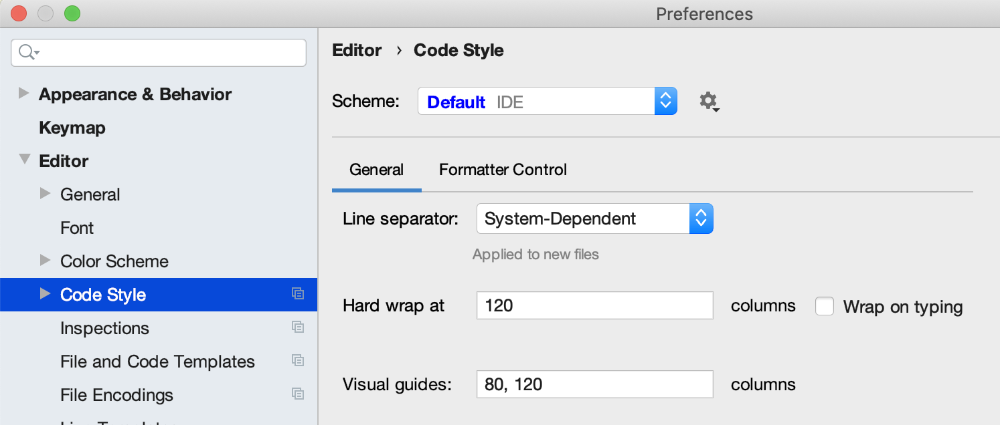

# Backend

This is a parent module of the Manual Review application. The application follows microservice architecture and contains 
the following main executable modules:
* [mr-queues](./queues) that responsible for real-time item processing in the queue-based paradigm.
* [mr-analytics](./analytics) that responsible for post-processing analysis and reporting. 

The module combines all services and provides common
configurations like `.gitignore` and `settings.gradle`. It doesn't strictly depends on any other service, except for
core project libraries:
* [cosmos-utilities](./cosmos-utilities)
* [model](./model)
* [azure-graph-clientl](./azure-graph-client)

In the document below you can find the following information for developers and supporters:
* [Getting started](#getting-started)
* [Reference documentation description](#reference-documentation)
* [Style guide](#style-guide)

## Getting Started

These instructions will get you a copy of the project up and running on your local machine for development and
testing purposes. See [deployment](../arm/README.md) for notes on how to deploy the project on a live system.

### Prerequisites

* Az Cli version 2.10.0
* Oracle Java 11.0.8
* The recommended IDE is the IntelliJ IDEA.
* For the Lombok usage, the IDE should have [Lombok plugin](https://plugins.jetbrains.com/plugin/6317-lombok) 
and enabled [annotation processing](https://stackoverflow.com/questions/41161076/adding-lombok-plugin-to-intellij-project).
* It's recommended to use `./gradlew` script for building and running. So, there is no need to install Gradle.
* for integrations you should have an account that has access to Azure Tenant and Azure Subscription used for deployment
and also has access to read Azure Key Vault secrets in required environment.

### Building

The project is running under Gradle configuration and has multi-module architecture. There are two executable modules: 
`queues` and `analytics` along with several libraries. Libraries are intended to separate
common logic across reusable modules. It's not possible to run libraries apart from
executable modules. You should build and run executable modules with `./gradlew` or `.\gradlew.bat` 
scripts inside their folders.

In case if you only need to build executable packages you can use
```shell script
./gradlew bootJar
```
to get a `.jar` file in `./build/libs` folder or
```shell script
./gradlew clean packageDist
```
to get a `.zip` file in `./build/dist` that can be used for uploading to 
[Azure App Service](https://azure.microsoft.com/en-us/services/app-service/) instance.

For comprehensive build with
```shell script
./gradlew build
``` 
you need to provide mocked [integrations](#configure-integration) such as EventHub, CosmosDB, Azure AD, and etc. 
and use actual credentials. These services are used for integration tests that currently aren't separated 
from unit tests. Thus be cautious in choosing your environment variables and foresee risks of 
unoptimized code to avoid unexpected costs in Azure resources.

### Configure integration 

To get the whole environment installed, please, refer to  [deployment](../arm/README.md).
To get environment variables that are used by application to connect to cloud environment, run [script](./getEnv.sh)
with specified environment name:
```shell script
/getEnv.sh "<name_that_is_prefix_of_deployment>"
```
__Warning!__ You need to be unlogined in "Az Cli" or be logined with appropriate account. In first case the script will
route you to login page.   
__Warning!__ In order to get all variables you should have enough [permissions](#prerequisites).

The script output under the `-----[ Result ]-----` row will contain the set of variables that you need to have 
established in your environment before local launch or comprehensive build.

__Warning!__ Values in the script output are unescaped. Be careful if there are special symbols. 

### Local Launch

To install the project locally please follow these steps:
1. Define environment variables from that you extracted from [existing installation](#configure-integration) ether in 
a terminal session if you run from console or in IDE run configuration if you work with it 
(e.g. [run configuration in IDEA](https://www.jetbrains.com/help/objc/add-environment-variables-and-program-arguments.html#add-environment-variables)).
2. Execute command `./gradlew clean build` in project root directory or run `clean` and then `build` tasks in IDE
3. Define advanced variables for `bootRun` task in queues/analytics modules:
    * `SPRING_PROFILES_ACTIVE=local` activates `application-local.yml` configuration which overrides default `application.yml` file.
    * `SPRING_OUTPUT_ANSI_ENABLED=ALWAYS` prints colorful logs in console output.
    * `SERVER_PORT=8081` change the port of one spring application to 8081 to be able to run both of them simultaneously.
4. Execute command `./gradlew bootRun` in project root directory or run `bootRun` task in IDE in order to launch application locally

Here's an example of shared `${PROJECT_DIR}/.idea/runConfiguration/queues__GRADLE_.xml` config exported for Queues BE.
You can replace environment variables with those that are required for your solution and import it into your IDE.
```
<component name="ProjectRunConfigurationManager">
  <configuration default="false" name="queues" type="GradleRunConfiguration" factoryName="Gradle">
    <ExternalSystemSettings>
      <option name="env">
        <map>
          <entry key="SPRING_OUTPUT_ANSI_ENABLED" value="ALWAYS" />
          <entry key="SPRING_PROFILES_ACTIVE" value="local" />
        </map>
      </option>
      <option name="executionName" />
      <option name="externalProjectPath" value="$PROJECT_DIR$/queues" />
      <option name="externalSystemIdString" value="GRADLE" />
      <option name="scriptParameters" value="" />
      <option name="taskDescriptions">
        <list />
      </option>
      <option name="taskNames">
        <list>
          <option value="bootRun" />
        </list>
      </option>
      <option name="vmOptions" value="" />
    </ExternalSystemSettings>
    <GradleScriptDebugEnabled>true</GradleScriptDebugEnabled>
    <method v="2" />
  </configuration>
</component>
```

Below there are additional integration options for local launch. 

#### Application Insights

If you'd like to use Application Insights in your local launch then continue from step 2 in [launch flow](#local-launch):

3. Build both modules with `./gradlew bootJar` command.
4. Add environment variables to your current session:
* `APPLICATIONINSIGHTS_CONNECTION_STRING` is needed for AI javaagent to initialize Exporter which will send
all telemetry to the cloud.
* `APPLICATIONINSIGHTS_CONFIGURATION_FILE` is optional. It sets the path for ApplicationInsights.json configuration which
will override project default ApplicationInsights.json file.
5. Run each built module with `java -Dspring.profiles.active=local
-javaagent:<project-dir>/backend/<module>/build/resources/main/applicationinsights-agent-3.0.0-PREVIEW.5.jar
-jar <module>/build/libs/<module>-0.0.1-SNAPSHOT.jar` command. `<module>` is either `analytics` or `queues`.

Here's an example of shared `${PROJECT_DIR}/.idea/runConfiguration/analytics__JAR_.xml` config exported with `msd365fp-mr-ai1`
solution variables for Analytics BE. You can replace environment variables with those that are required for your solution
and import it into your IDE.
```
<component name="ProjectRunConfigurationManager">
  <configuration default="false" name="analytics [JAR]" type="JarApplication">
    <option name="JAR_PATH" value="$PROJECT_DIR$/analytics/build/libs/analytics-0.0.1-SNAPSHOT.jar" />
    <option name="VM_PARAMETERS" value="-javaagent:$PROJECT_DIR$/analytics/build/resources/main/applicationinsights-agent-3.0.0-PREVIEW.5.jar -Dserver.port=8081 -Dspring.profiles.active=local -Dspring.ansi.output.enabled=ALWAYS" />
    <option name="WORKING_DIRECTORY" value="$PROJECT_DIR$/analytics" />
    <option name="ALTERNATIVE_JRE_PATH" />
    <envs>
      <env name="APPLICATIONINSIGHTS_CONFIGURATION_FILE" value="$USER_HOME$/mr/ApplicationInsights_analytics.json" />
      <env name="APPLICATIONINSIGHTS_CONNECTION_STRING" value="InstrumentationKey=99bd42f3-5738-4d01-9c74-aee2d147133a" />
    </envs>
    <method v="2">
      <option name="Gradle.BeforeRunTask" enabled="true" tasks="bootJar" externalProjectPath="$PROJECT_DIR$/analytics" vmOptions="" scriptParameters="" />
    </method>
  </configuration>
</component>
```

#### Key Vault

Both services use Azure KeyVault integration to manage secrets for all dependencies. 
By default [managed identity](https://docs.microsoft.com/en-us/azure/app-service/overview-managed-identity?tabs=dotnet)
way of authentication is used. This is a preferable way for cloud application to rotate secrets this way. However, it is not
currently supported by Azure Java SDK to use managed identity locally, so 
[service principle](https://docs.microsoft.com/en-us/azure/key-vault/secrets/quick-create-java#create-a-service-principal)
is used instead for local usage. You don't need to provide extra secrets for this solution, because Azure AD secret is used
as client key.  

## Reference Documentation

### Technical Specification

Please read this document to familiarize yourself with technical details of the project and business ideas behind them.
https://docs.google.com/document/u/1/d/1we5YZDPwda8MTp-6FHqsfEwEfzBZi_Wi3AeLrfzcaug/edit?ts=5ee8741d&pli=1#heading=h.dydw8omr4619

### Dependencies

For further reference, please consider the following sections:
* [Official Gradle documentation](https://docs.gradle.org)
* [Spring Boot Gradle Plugin Reference Guide](https://docs.spring.io/spring-boot/docs/2.2.6.RELEASE/gradle-plugin/reference/html/)
* [Spring Web](https://docs.spring.io/spring-boot/docs/2.2.6.RELEASE/reference/htmlsingle/#boot-features-developing-web-applications)
* [Spring Data JPA](https://docs.spring.io/spring-boot/docs/2.2.6.RELEASE/reference/htmlsingle/#boot-features-jpa-and-spring-data)
* [Spring WebFlux](https://docs.spring.io/spring/docs/current/spring-framework-reference/web-reactive.html)
* [Azure Support](https://github.com/Microsoft/azure-spring-boot/tree/master/azure-spring-boot)
* [Azure CosmosDB Spring Boot](https://docs.microsoft.com/en-us/azure/developer/java/spring-framework/configure-spring-boot-starter-java-app-with-cosmos-db) - document database API
* [Azure Active Directory Spring Boot](https://docs.microsoft.com/en-us/azure/active-directory/develop/v2-oauth2-client-creds-grant-flow) - web security API
* [Azure EventHub Spring Boot](https://docs.microsoft.com/en-us/azure/developer/java/spring-framework/configure-spring-cloud-stream-binder-java-app-azure-event-hub)
* [modelmapper](http://modelmapper.org/) - object mapping mechanism
* [springdoc-openapi](https://springdoc.org/) - generates API documentation

### Backlog

Refer to our [jira](https://griddynamics.atlassian.net/secure/RapidBoard.jspa?rapidView=45) for the backlog.

## Style Guide

* The source code formatting should follow the default IntelliJ IDEA code style preferences.
* The source code should follow default Sonar rules. As much as possible warnings and errors 
reported by [SonarLint](https://plugins.jetbrains.com/plugin/7973-sonarlint) plugin should be resolved.
The current list of rules designates between controversal types of writing code 
and should override Sonar rules if any intersect.
* All temporary features and code parts should be marked by TODO comments.
* Java code should not exceed 120 symbols per line. JavaDocs should not exceed 80 symbols per line. To follow such restrictions
please setup outliners like on this picture:

* Spring Controller with a lot of annotations in parameters should have parameter declaration on the different line from annotations. E.g.:
```java
    @Operation(summary = "Get performance metrics for list of queues")
    @GetMapping(value = "/labeling/queues", produces = MediaType.APPLICATION_JSON_VALUE)
    @Secured({PREFIXED_MANAGER_ROLE})
    public Set<ItemLabelingMetricsByQueueDTO> getItemLabelingMetricsByQueue(
            @Parameter(description = FROM_PARAM_DESCRIPTION, example = FROM_PARAM_EXAMPLE)
            @DateTimeFormat(iso = DateTimeFormat.ISO.DATE_TIME)
            @RequestParam
                    OffsetDateTime from,
            @Parameter(description = TO_PARAM_DESCRIPTION, example = TO_PARAM_EXAMPLE)
            @DateTimeFormat(iso = DateTimeFormat.ISO.DATE_TIME)
            @RequestParam
                    OffsetDateTime to,
            @Parameter(description = AGGREGATION_PARAM_DESCRIPTION)
            @Schema(type = "string", format = SWAGGER_DURATION_FORMAT, example = SWAGGER_DURATION_EXAMPLE)
            @RequestParam
                    Duration aggregation,
            @Parameter(description = ANALYSTS_PARAM_DESCRIPTION)
            @RequestParam(value = "analyst", required = false)
                    Set<String> analystIds,
            @Parameter(description = QUEUES_PARAM_DESCRIPTION)
            @RequestParam(value = "queue", required = false)
                    Set<String> queueIds
    ) {
        return performanceService.getItemLabelingMetricsByQueue(from, to, aggregation, analystIds, queueIds);
    }
```
* Order of annotations on classes should be (the first one is the closest to class declaration): `org.springframework` >
`org.projectlombok` > `io.swagger.core` > other

### Logging

By default Spring Boot starters use Logback framework as logging provider. As long as we have Lombok, we are able to put `@Slf4j`
annotation to our classes which creates following statement:
```java
Creates private static final org.slf4j.Logger log =
    org.slf4j.LoggerFactory.getLogger(LogExample.class);
```

In cloud environment logs are flowing into Azure Application Insights (AI) resource alongside with another
[telemetry](https://docs.microsoft.com/en-us/azure/azure-monitor/app/java-in-process-agent#autocollected-requests-dependencies-logs-and-metrics).
AI aggregates logs among all instances of the solution (including both modules) in one place. In the AI resource
they are called _traces_ and be queried from the `trace` table using
[Kusto query language (KQL)](https://docs.microsoft.com/en-us/azure/azure-monitor/log-query/log-query-overview).

Integration with AI was made with Application Insights Java Agent which requires `ApplicationInsights.json`
configuration file (agent don't need to be in the classpath, but config file have to be placed near the agent whereever
it is).

#### Known issues:
* Can't send telemtry for requests with spaces in the url, e.g.: https://graph.microsoft.com/v1.0/servicePrincipals?$ filter=appId eq '935c35fb-d606-4e27-b2f8-802af975bea6'
[github issues](https://github.com/microsoft/ApplicationInsights-Java/issues/1290)
* Web client GET requests are not captured. [github issues](https://github.com/microsoft/ApplicationInsights-Java/issues/1276)
* Operation context is not created when message is comming from EventHub, so it's not possible right now to trace all
insights produced by incoming message. [stackoverflow](https://stackoverflow.com/questions/63235493/how-to-preserve-operationid-when-sending-message-through-azure-eventhub)

You can read more about the implementation [here](https://docs.microsoft.com/en-us/azure/azure-monitor/app/java-in-process-agent).

#### Rules

Overall rules:
1. Try to put descriptive message inside a log. Message can be called descriprive when it's shortly describes the outcome of
the execution block it refers to.
2. Try to avoid overused and repitive messages.
3. When hesitaiting to choose a log level (and your case is not described in [severities](#severities) guideliness),
tend to choose lesser severity log.
4. Avoid printing sensitive information in log messages.
5. Avoid using logs inside loops that don't operate with external resources (e.g. EventHub, CosmosDB, Active Directory), instead accumulate the result at the end of the loop.
6. Every log resolvable argument should be wrapped in rectangular brackets (no other symbols are allowed), so
your log should look like that: `log.warn("Error occurred during queue [{}] processing.", queue.getId())`. Also don't
forget to add a dot at the end of the sentence.
7. It's prefreable to put long string arguments after error explanation sentence:
`log.error("Error occurred during queues processing: [{}]", queueIds)`.
8. Resolvable arguments of a log which are reserved for another exception message should not be surrounded with brackets:
`log.warn("Excpected error occurred. {}. Reverting changes.", ex.getMessage())`

#### Severities

**ERROR** - `log.error` calls have to be used when you need explicitly define unexpected errors (when exception
coudn't/shouldn't be thrown) in the program. All error logs should have stack trace as a second parameter. Logs of such
severity always need to be turned on in cloud instance.
**WARNING:** This log level should be always turned on!

**WARN** - `log.warn` calls have to be used to define potential errors in the program. Logs
of such severity can be turned off only when the solution version is stable and it needs to be cost-effective.
**WARNING:** Turning off this log level makes triage impossible for some cases!

**INFO** - `log.info` calls have to be used before:

- any attempt to make changes in persisted state (entry in the database, sending message/event, posting of changes to
connected systems by any protocol) with short description of changes and with obligatory indication of tracking information
(e.g. id, actor, etc.)

`log.info` calls have to be used after:

- any attempt to make changes in a persisted state with the description of results
- any business decision applied in the code or any condition check that impacts the result of the business operation
- any condition that restricts user in the getting of information despite successful authorization

Logs of such severity can be turned off only when the solution version is stable and it needs to be cost-effective.
**WARNING:** Turning off this log level makes triage impossible for some cases!

**DEBUG** - `log.debug` calls have to be used for debugging purposes of unexpected behavior. This is the hardest log level
to consider during development which always tends to be overused. Therefore it preferable to use it when:

* it's obvious that the current block of code tends to have bugs in it
* it adjoins egress/ingress integration points (such as REST API, EventHub event streaming)
* to print verbose values that were not included in the INFO level of the same block of code

Logs of such severity always need to be turned off in cloud, unless they are written to the filesystem.

**TRACE** - `log.trace` calls are prohivited in the solution and should be avoided. You can use them in development, but
during pull request review they have to be removed.
