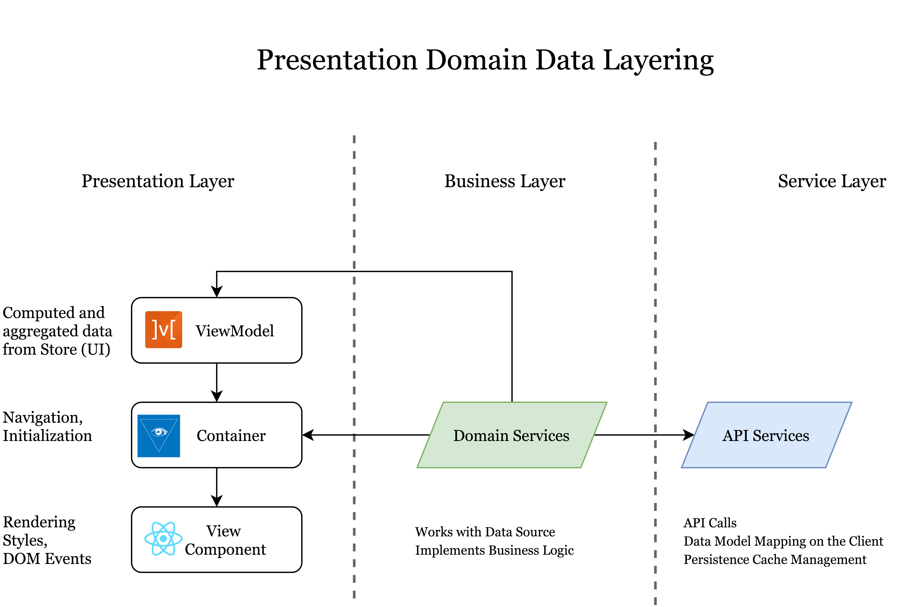

# Manual Review Contribution guide (frontend)

This document:
* contains low-level solution details
* is used as an onboarding guide for newcomers
* describes how to contribute to the project front-end part (FE)
* should be considered by contributors to pass PR (pull request) procedure 

> The project is alive and rapidly extended so if you see any inaccuracies, please, 
notify maintainers of the solution. We appreciate any feedback.

Summary: 
* [Architecture description](#architecture-description)
    + [In-place solutions overview](#in-place-solutions-overview)
    + [Frontend application layers](#frontend-application-layers)
    + [Top-level folder structure](#frontend-folder-structure)
* [Contribution rules](#contribution-rules)
    + [Reporting a bug](#reporting-a-bug)
    + [Pull requests](#pull-requests)
    + [Copyright and licensing](#copyright-and-licensing)
* [Code style](#code-style)
    + [Pull request labels](#pull-request-labels)
    + [Git commit messages](#git-commit-messages)
    + [Code of conduct](#code-of-conduct)
* [FAQ](#faq)

## Architecture description

* Frontend is built using Single Page Application approach. 
* It handles user authentication by implementing [Microsoft identity platform and OAuth 2.0 authorization code flow](https://docs.microsoft.com/en-us/azure/active-directory/develop/v2-oauth2-auth-code-flow).
* Frontend by itself has no runtime after it has been built for production, this allows it to be hosted as a static bundle on Azure Storage Account 
and expose it to the public via Static Website approach, which makes it highly cost efficient. 
* Frontend communicates with both Queues and Analytics Services via exposed REST APIs.
* The application is starting by executing bootstrap task queue. The order of invocation is important, since tasks are dependent on previous results.
* State management concept was utilized for storing the data.
* All the component dependencies are added through the dependency inversion SOLID approach. 

### In-place solutions overview

1. [Typescript](https://www.typescriptlang.org/) is used as language, that extends JavaScript with types, so all the data models have their interfaces. 
2. [React](https://reactjs.org/) is used as an SPA framework. In most cases we preferred Class components over React hooks.
3. [Sass](https://sass-lang.com/) preprocessor is used as a CSS extension language.
4. [React router](https://reactrouter.com/) is utilized for navigation. You can find the ROUTES_LIST in `frontend/app.tsx` and navigation menu in `frontend/src/components/page-layout/left-navigation/left-navigation.tsx`.
5. [MobX](https://mobx.js.org/) is used for the state management and files with a name ends with `store` should be treated as MobX stores. 
6. Dependency inversion principle was leveraged with [InversifyJS](http://inversify.io/). 
   * This means, all the services are registered as IoC containers within the application bootstrap (find more details in `frontend/src/application-bootstrap/` folder).
   * Each service has a unique token - Symbol type value associated with the service (find the list in `frontend/src/types.ts`)
   * If you want to use any service or MobX store in the React component you need to inject it using the following pattern:
       ```
         @resolve(TYPES.<service-token>)
            <service-name-for-component>: <service-class-name>;
       ```
      Code example:
       ```typescript
         @resolve(TYPES.SEARCH_SCREEN_STORE)
            private searchScreenStore!: SearchScreenStore;
       ```
7. [Create React App](https://github.com/facebook/create-react-app) was used for application build. 
   
   However, the default configuration was ejected, and you can find customised webpack configuration for the local development as well as for the production build in the next folder: `frontend/config/`. 
   It was done in order to use parameter decorators, for example:
    ```typescript
    import { inject, injectable } from 'inversify';
    
    @injectable()
    export class AwesomeStore {
         constructor(@inject("SOME_SERVICE") private customerService: any) {}
    }
    ```
    At this point Babel does not have proper support of parameter decorators ([Issue reference](https://github.com/babel/babel/issues/9838)). However, Typescript does, so we changed webpack 
configuration to process .ts and .tsx with `ts-loader` instead of `babel-loader` that was out of the box with create-react-app.
    
8. [Moment.js](https://momentjs.com/) is used in utils functions to work with the dates.
9. The application is integrated with [Azure Maps](https://docs.microsoft.com/en-us/azure/azure-maps/). 
   * FE requesting token for azure Maps API through the request to queues BE module (Find more details in `frontend/src/utility-services/azure-maps-service.ts`)
   * Map itself is used in the next component `frontend/src/screens/review-console/item-details/parts/transaction-map/map/map.tsx`
10. A collection of UX controls [Fluent UI](https://developer.microsoft.com/en-us/fluentui#/controls/web) was used for creating the components.
11. Some [Nivo](https://nivo.rocks/components) componets was used for building charts on the Dashboard pages. 

### Frontend application layers


1. API services - interact with both Queues and Analytics BE services, by using [axios HTTP client](https://github.com/axios/axios). Usually all the response (DTO) models interfaces are placed in the folder with the service implementation.
2. Domain Services - work with Data Source and implement business logic. They usually use data-transformers to convert an API response (DTO) model to a view model.
3. View Services - MobX Stores with the computed and aggregated data for the View model. 
4. As described in [In-place solutions overview](#in-place-solutions-overview) section they are registered as Inversify containers and injected into components. 
5. View components - React components responsible for rendering the view, handling DOM events and styling.

### Frontend folder structure
```
./frontend
    |+-- config                     // customised webpack configuration for the both local development and production build
    |    +--jest                    // Jest configuration
    |+-- public                     // has entrypoint index.html, favicon etc
    |    +-- index.html
    |+-- scripts                    // node scripts implementation for the npm commands: `start, test, build`
    |+-- src
    |    +-- application-bootstrap  // Task queue for bootstrapping the application: service registering tasks, some data pre-loading, etc
    |    +-- assets                 // SVG pictures, icons
    |+-- constants                  // different constants, enums
    |   +-- components              // reusable components with common logic that are used in several places.
    |   +-- data-services           
    |       +-- api-services        // services for interacting with BE
    |       +-- data-transformers   // transformers for converting API response into View models
    |       +-- domain-services     // services that works with data source and implements businness logic 
    |       +-- interfaces          // Typescript interfaces for both API and Domain services
    |   +-- models                  // view data models (classes and interfaces)
    |   +-- screens                 // top-level React components for the route pages and their parts 
    |   +-- styles                  // common SCSS variables for colors and sizes
    |   +-- utility-services        // services not related to any business entity, like authentication-service, azure-maps-service, local-storage-service etc
    |   +-- utils                   // helper functions for working with dates, text, colors, etc
    |   +-- view-services           // MobX stores
```

## Contribution rules
We use [Github Flow](https://guides.github.com/introduction/flow/index.html), so all code changes happen through Pull Requests.

### Reporting a bug
We use GitHub issues to track public bugs. Report a bug by opening a new issue; it's that easy!
Please refer to project's git hub issue.

### Pull Requests
1. **Fork** the repo on GitHub
2. **Clone** the project to your own machine
3. **Commit changes** to your own branch
4. **Push** your work back up to your fork
5. **Create a PR** to merge this branch to the `development` branch

NOTE: Before opening the PR, please make sure you have read our Code style section: ([Git Commit Messages](#git-commit-messages), [Pull Request Labels](#pull-request-labels))

### Copyright and licensing
The project is licensed under the [MIT License](http://choosealicense.com/licenses/mit/).

When you submit code changes, your submissions are understood to be under the same [MIT License](http://choosealicense.com/licenses/mit/) that covers the project. Feel free to contact the maintainers if that's a concern.

Include a license header at the top of each new file.
````
Copyright (c) Microsoft Corporation.
Licensed under the MIT license.
````
* [TSX file license example](https://github.com/griddynamics/msd365fp-manual-review/blob/80509535eb9e9a25f0ce1137a1de5ce1503a4c3f/frontend/src/index.tsx#L1)
* [TS file license example](https://github.com/griddynamics/msd365fp-manual-review/blob/80509535eb9e9a25f0ce1137a1de5ce1503a4c3f/frontend/src/types.ts#L1)

## Code style

For the linting frontend code we use [ESlint](https://eslint.org/) configured along with [Airbnb's ESLint config with TypeScript support](https://www.npmjs.com/package/eslint-config-airbnb-typescript)

Configuration file: [./frontend/.eslintrc]( https://github.com/griddynamics/msd365fp-manual-review/blob/master/frontend/.eslintrc)

### Pull request labels

 Label name | Description
| --- | --- |
| `FRONTEND` |  Pull requests which have developed functionality for the `frontend` module. |
| `BACKEND`  |  Pull requests which have developed functionality for the `backend` module.|
| `HOT_FIX` |  Pull requests which have fixes for the bugs and needs to be merged into `master` branch. |
| `BUG_FIX`   | Pull requests which have fixes for a specific bugs and needs to be merged into `development` branch.  |
| `WIP`     |  Pull requests which are still being worked on, more changes will follow.  |

### Git commit messages
1. Commits have to be descriptive and contain only changes related to the story which you picked for development.

2. Each commit must contain a tag at the beginning of the commit message indicating where changes where made.
    * `[BE]` for the `backend` module
    * `[FE]` for he `frontend` module accordingly.

3. Limit the first line to 72 characters or less

4. You can look at the commit history find an example of a common commit.

### Code of conduct
Find detailed information in the [Microsoft Open Source Code of Conduct](https://opensource.microsoft.com/codeofconduct).

## FAQ
#### Components decoration with @autoBind and @observer
In case you use both decorators on the same class you may find a warning in console. This may happen
because @autoBind changes the render function (e.g. `this.render = this.render.bind(this);`), and it can not be ovserved by 
mobX anymore.
> `The render function for an observer component (<Component Display Name>) was modified after MobX attached. This is not supported, since the new function can't be triggered by MobX.`

🚫 Will trigger a warning in case component is unmounted and mounted again.
```typescript jsx
import React, { Component } from 'react';
import { observer } from 'mobx-react';
import autoBind  from 'autobind-decorator';

@observer
@autoBind
export class Button extends Component<{data: any}, never> {
    onClick() { console.log(this.props.data); }
    render() { return (<button onClick={this.onClick} />); }
}
```
✅ Will not trigger a warning (recommended approach)
```typescript jsx
import React, { Component } from 'react';
import { observer } from 'mobx-react';
import autoBind  from 'autobind-decorator';

@observer
export class Button extends Component<{data: any}, never> {
    @autoBind
    onClick() { console.log(this.props.data); }
    
    render() { return (<button onClick={this.onClick} />); }
}
```